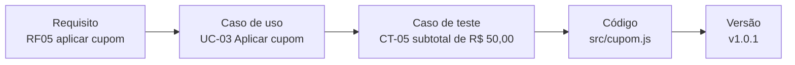

# Delivery 3001

[](https://github.com/idcesares/delivery-3001/actions/workflows/testes.yml)

O app de delivery da turma **3001** de Engenharia de Software (TMS0092 · Estácio · 2026.2).

Ele nasceu no chat da Aula 6, quando a turma levantou os requisitos de um app de comida. Desde a Aula 7 ele está **em produção**: o cupom PRIMEIRA10 foi lançado, os clientes começaram a usar e os chamados começaram a chegar.

Aqui a turma faz o que um time de software faz depois da entrega: recebe chamados, decide o que corrigir, testa, versiona e lança de novo.

### Comece por aqui

Não precisa instalar nada nem saber programar. Para acompanhar a aula, basta olhar três coisas:

1. **[Casos de uso](docs/casos-de-uso.md):** quem faz o quê no app, com o diagrama e o UC-03 Aplicar cupom detalhado.
2. **[Casos de teste](docs/casos-de-teste.md):** os testes da turma. A primeira tabela é a que o robô executa sozinho.
3. **[Chamados](https://github.com/idcesares/delivery-3001/issues):** o que os clientes e o time reclamaram desde que a v1.0.0 entrou no ar.

| | |
|---|---|
| **Versão em produção** | [v1.0.0](https://github.com/idcesares/delivery-3001/releases) |
| **Chamados abertos** | [Issues](https://github.com/idcesares/delivery-3001/issues) |
| **Mudanças propostas** | [Pull requests](https://github.com/idcesares/delivery-3001/pulls) |
| **O que mudou em cada versão** | [CHANGELOG.md](CHANGELOG.md) |

---

## O que tem aqui

```
delivery-3001/
├── README.md               esta página
├── CHANGELOG.md            o que mudou em cada versão
├── docs/
│   ├── requisitos.md       o que o sistema deve fazer (RF) e como deve se comportar (RNF)
│   ├── casos-de-uso.md     quem faz o quê, com diagrama e o UC-03 Aplicar cupom detalhado
│   ├── casos-de-teste.md   os testes da turma, incluindo o quadro que o robô executa
│   ├── mapa-testes.md      esqueleto do mapa mental de testes
│   └── diagramas/          o diagrama de casos de uso em formato diagrams.net
├── src/
│   └── cupom.js            a regra do cupom PRIMEIRA10 (sim, com defeitos)
└── tests/
    └── cupom.test.js       o robô que lê o quadro de casos e testa o código
```

O caminho de uma ideia até o código aparece nos arquivos, nesta ordem:



---

## Como participar (sem instalar nada)

Para a tarefa de casa (o mapa mental) ou para o desafio #6. Tudo pelo navegador, sem saber programar.

1. **Entre na sua conta do GitHub.** Não tem? Crie em [github.com/signup](https://github.com/signup).
2. **Abra o arquivo** que você quer mudar (por exemplo, [docs/casos-de-teste.md](docs/casos-de-teste.md)) ou, para criar um arquivo novo, clique em **Add file > Create new file**.
3. **Clique no lápis** (canto superior direito do arquivo). Se o GitHub perguntar, clique em **Fork this repository**: ele cria a sua cópia do projeto, na sua conta.
4. **Faça a mudança** direto na tela.
5. Clique em **Commit changes...** e escreva uma frase dizendo o que você fez. Ex.: `Mapa mental da Ana`.
6. Clique em **Propose changes** e depois em **Create pull request**.
7. **Espere o robô.** Em menos de um minuto aparece um sinal verde ou um X vermelho na sua proposta.

Pronto: você abriu um **pull request**. O professor revisa e, se estiver tudo certo, a sua mudança entra na versão principal.

> **Primeira vez?** Na primeira proposta de cada pessoa, o robô espera o professor autorizar antes de rodar. É uma proteção do GitHub, não é erro seu.
>
> **Travou?** Sem problema: poste o que você fez na thread da aula no Teams. O importante é a ideia chegar.

---

## O robô de testes

Toda proposta de mudança passa pelo robô (GitHub Actions). Ele lê o quadro **Casos automatizados** de [docs/casos-de-teste.md](docs/casos-de-teste.md), roda cada linha contra o código e compara com o resultado esperado.

- **Sinal verde:** todos os casos do quadro passaram.
- **X vermelho:** algum caso pegou o código fazendo diferente da regra.

Um X vermelho **não é derrota**. Se você acrescentou um caso e ele ficou vermelho, você achou um defeito antes do cliente. Esse é o primeiro passo do TDD: **vermelho, verde, refatorar**.

E o contrário também vale: sinal verde não quer dizer que não há defeito. Quer dizer que nenhum caso do quadro achou um.

---

## Como os números de versão funcionam

O Delivery 3001 usa **versionamento semântico**: `MAIOR.MENOR.CORREÇÃO`.

| Mudou o quê? | Número que sobe | Exemplo |
|---|---|---|
| Corrigiu um defeito, sem mudar o que o sistema oferece | o último | v1.0.0 → **v1.0.1** |
| Acrescentou algo novo, e tudo o que existia continua funcionando | o do meio | v1.0.1 → **v1.1.0** |
| Mudou de um jeito que quebra quem dependia da versão anterior | o primeiro | v1.1.0 → **v2.0.0** |

Quando o número sobe, a gente cria uma **tag** (uma etiqueta naquele ponto do histórico) e publica uma **release** (a tag com as notas do que mudou).

---

## Glossário de bolso

| Palavra | Em português de gente |
|---|---|
| **Repositório** | A pasta do projeto, com a memória de tudo o que já mudou nela |
| **Commit** | Uma foto do projeto salva com uma legenda: "o que eu mudei e por quê" |
| **Branch** | Um rascunho paralelo para mexer sem estragar a versão principal |
| **Fork** | A sua cópia do repositório inteiro, na sua conta |
| **Pull request (PR)** | "Posso colocar a minha mudança na versão principal?", com a mudança à mostra para revisão |
| **Merge** | Aceitar a mudança e juntá-la à versão principal |
| **Conflito** | Duas pessoas mudaram a mesma linha; alguém precisa decidir como fica |
| **Issue** | Um chamado: defeito relatado, pedido de mudança, tarefa |
| **Tag** | Uma etiqueta num ponto do histórico: "esta foto aqui é a v1.0.0" |
| **Release** | A tag com as notas de lançamento: o que foi para produção |
| **Actions** | O robô que roda sozinho a cada mudança |

Se a ideia de "versão" parece abstrata, lembre do `trabalho_final_v2_AGORA_VAI_revisado.docx`. O Git existe para ninguém precisar viver assim.

---

## Materiais da disciplina

- Vídeo: [Você ainda faz testes de software manuais?](https://www.youtube.com/watch?v=fxL04i00jJw)
- Vídeo: [Entenda o Git em 10 minutos](https://www.youtube.com/watch?v=FV-hMoqHtcU)
- Sommerville, *Engenharia de Software*, 10ª ed.: testes (p. 203 a 230) e gerência de configuração (cap. 25), na Biblioteca Virtual
- Pressman e Maxim, *Engenharia de Software*: testes (p. 466 a 480), na Minha Biblioteca

---

Turma 3001 · Prof. Isaac D'Césares · TMS0092 Engenharia de Software · 2026.2
