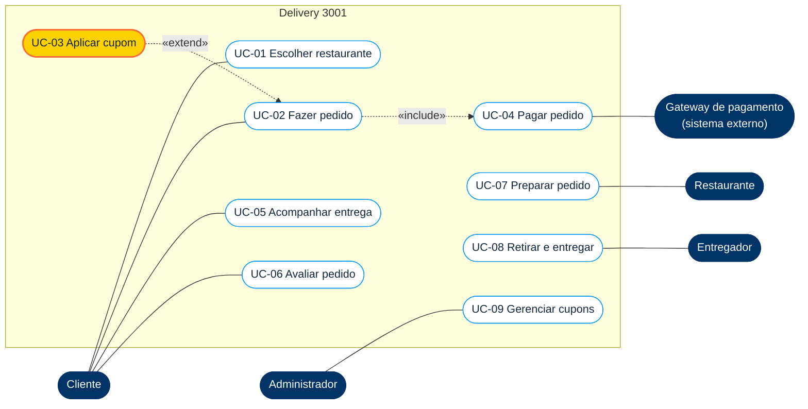

# Casos de uso · Delivery 3001

O diagrama responde **quem faz o quê** com o sistema. Os bonecos (atores) ficam do lado de fora; as elipses (casos de uso) ficam dentro da caixa do sistema. Cada requisito funcional de [requisitos.md](requisitos.md) aparece em pelo menos um caso de uso.

## Diagrama

**Como ler as setas tracejadas**

- **«include»**: o caso sempre acontece junto. Todo pedido passa pelo pagamento.
- **«extend»**: o caso acontece só às vezes, sob uma condição. Nem todo pedido tem cupom.

O mesmo diagrama em formato editável do diagrams.net está em [diagramas/casos-de-uso.drawio](diagramas/casos-de-uso.drawio). Para abrir: entre em [app.diagrams.net](https://app.diagrams.net), escolha **Abrir de > Dispositivo** e selecione o arquivo baixado.

## Rastreabilidade

| Caso de uso | Ator principal | Requisitos |
|---|---|---|
| UC-01 Escolher restaurante | Cliente | RF01, RF02, RF03 |
| UC-02 Fazer pedido | Cliente | RF04, RF07 |
| UC-03 Aplicar cupom | Cliente | RF05 |
| UC-04 Pagar pedido | Cliente, Gateway | RF06 |
| UC-05 Acompanhar entrega | Cliente | RF08 |
| UC-06 Avaliar pedido | Cliente | RF09 |
| UC-07 Preparar pedido | Restaurante | RF10 |
| UC-08 Retirar e entregar | Entregador | RF11 |
| UC-09 Gerenciar cupons | Administrador | RF05 |

---

## UC-03 Aplicar cupom (detalhado)

Um diagrama mostra o mapa. A descrição do caso de uso mostra o caminho. É dela que saem os casos de teste.

| Campo | Conteúdo |
|---|---|
| **Ator principal** | Cliente |
| **Objetivo** | Pagar menos no primeiro pedido usando o cupom PRIMEIRA10 |
| **Pré-condição** | Cliente identificado, com itens no carrinho |
| **Pós-condição** | O total do pedido mostra o desconto, ou o cliente sabe por que o cupom não entrou |
| **Relação** | Estende UC-02 Fazer pedido |

### Regras de negócio

| ID | Regra |
|---|---|
| RN-01 | O desconto é de 10% sobre o subtotal |
| RN-02 | Vale só no primeiro pedido do cliente |
| RN-03 | Vale só para subtotal a partir de R$ 50,00 |
| RN-04 | O desconto máximo é de R$ 15,00 |
| RN-05 | O frete não entra no desconto |
| RN-06 | Um cupom por pedido |

### Fluxo principal

1. O cliente abre o carrinho e digita `PRIMEIRA10`.
2. O sistema confere se é o primeiro pedido do cliente (RN-02).
3. O sistema confere se o subtotal é de pelo menos R$ 50,00 (RN-03).
4. O sistema calcula 10% do subtotal, limitado a R$ 15,00 (RN-01, RN-04).
5. O sistema mostra o novo total: subtotal menos desconto, mais frete (RN-05).
6. O cliente segue para o pagamento (UC-04).

### Fluxos alternativos

| Fluxo | Quando | O que o sistema faz |
|---|---|---|
| A1 | Subtotal abaixo de R$ 50,00 (passo 3) | Recusa o cupom e informa quanto falta para o mínimo |
| A2 | Cliente já fez pedido antes (passo 2) | Recusa o cupom e explica que ele vale só no primeiro pedido |
| A3 | Já existe um cupom no pedido (passo 1) | Recusa o segundo cupom (RN-06). *Proposto pelo Jeferson, Aula 6* |
| A4 | O cliente remove itens depois do cupom aplicado | Recalcula o subtotal e volta ao passo 3. *Proposto pelo Jeferson, Aula 6* |

### De onde vêm os testes

Cada regra e cada fluxo alternativo é uma fonte de caso de teste. Veja [casos-de-teste.md](casos-de-teste.md): RN-03 gera CT-03 e CT-05, RN-04 gera CT-07, RN-05 gera CT-06, A3 gera CT-09, A4 gera CT-08.
