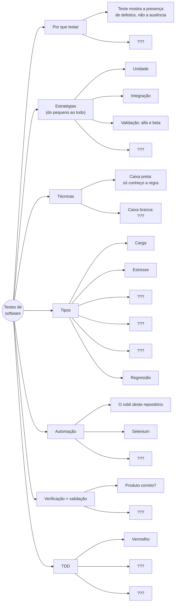

# Mapa mental · testes de software

Atividade da Aula 7. Este é o **esqueleto**: os galhos principais já estão aqui, mas metade das folhas está com `???`.

**Sua tarefa:** fazer o seu mapa completo, com tudo o que vimos sobre testes nas Aulas 6 e 7.

1. Copie o bloco abaixo.
2. Crie o arquivo `docs/mapas/seu-primeiro-nome.md` neste repositório (botão **Add file > Create new file**; o GitHub cria a pasta sozinho se você escrever `docs/mapas/` antes do nome).
3. Cole, troque cada `???` e acrescente pelo menos **um exemplo do Delivery 3001** em cada galho.
4. Proponha a mudança. O GitHub desenha o mapa sozinho na aba **Preview**.
5. **Travou no GitHub?** Poste o mapa na thread da Aula 7 no Teams (pode ser foto de um desenho no papel). O importante é o mapa chegar.

Dica: os seis tipos de teste do plano da disciplina são carga, estresse, usabilidade, segurança, recuperação e regressão. Os casos CT-10 a CT-13 de [casos-de-teste.md](casos-de-teste.md) são exemplos de alguns deles.
